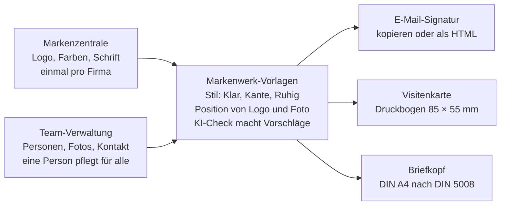

# Markenwerk: Projektverlauf

Stand: 29. September 2026, Maria Lux

## Kurzfassung

Markenwerk ist ein Produkt, das Renamic entwickelt, bisher unter Arbeitstitel: Eine Firma lädt ihr Logo hoch, trägt ihr Team ein und bekommt E-Mail-Signaturen, Visitenkarten und Briefköpfe für alle Mitarbeitenden. Zielgruppe für den Start sind Immobilienverwaltungen.

Stand heute gibt es ein Produktmodell als Präsentation, einen klickbaren Prototyp im Apple-Stil und den Code bei GitHub auf einem eigenen Zweig. Offen sind vor allem zwei Punkte: der Name, den mehrere Agenturen schon nutzen, und das Logo.

## Die Idee und das Produktmodell

Markenwerk soll ein eigenes Produkt werden, kein reiner Türöffner. Ausgangspunkt war der Signatur-Generator, den Maria für Renamic gebaut hat. Ralfs Beobachtung dazu: Viele Firmen kennen die Brand Kits von Canva gar nicht, und was sie dort selbst basteln, sieht oft schlecht aus. Markenwerk liefert fertige, sauber gestaltete Vorlagen.

Verkauft wird nicht die einzelne Signatur, sondern Ordnung bei der Marke: Ein Logo, eine Farbe, eine Schrift, und alle im Team haben dieselbe Ausstattung. Ändert sich das Logo, ändert es sich überall.

Firma und Team werden einmal gepflegt, daraus entstehen alle drei Vorlagen für jede Person.

| Baustein | Was er tut | Warum der Kunde zahlt |
| --- | --- | --- |
| Markenzentrale | Logo, Farben und Schrift an einem Ort, geprüft von der KI | Eine Version statt zehn |
| Vorlagen | Signatur, Visitenkarte und Briefkopf aus festen Profi-Vorlagen | Sieht gut aus, ohne Grafiker |
| Team-Verwaltung | Eine Person pflegt alle, Änderungen gehen an alle | Grund für ein dauerhaftes Abo |

Die KI gestaltet nicht frei. Sie liest Farben aus dem Logo, prüft die Lesbarkeit und schlägt Schrift, Stil und Claim vor. Die Qualität steckt in den festen Vorlagen.

**Nische:** Immobilienverwaltungen, mit Notdienstnummer in der Signatur, Pflichtangaben und Briefkopf nach DIN 5008. Gegen Canva als Allzweck-Werkzeug gewinnt Markenwerk nicht, in dieser Nische schon.

**Geldmodell:** ein Abo pro Firma nach Teamgröße (Preise noch offen), dazu die Einrichtung als Service und der Druck von Visitenkarten über eine Partnerdruckerei.

**Fahrplan:**

1. Signaturen und Team-Verwaltung, weil die Grundlage schon da ist
2. Pilot mit 5 bis 10 Verwaltungen aus dem Renamic-Umfeld
3. Visitenkarten als druckfertige PDF mit Anbindung an eine Druckerei
4. Briefkopf als Word-Vorlage

## Was bisher entstanden ist

Vier Ergebnisse gibt es, der Prototyp ist das aktuellste und zeigt alle Funktionen.

| Ergebnis | Was es ist | Stand |
| --- | --- | --- |
| [Klickbarer Prototyp](https://claude.ai/artifact/QqXCumFY2ngJwFZVkt1Pnw) | Die App zum Ausprobieren, gebaut aus demselben Code wie bei GitHub | Aktuell, Apple-Stil mit Logo- und Fotoposition |
| [Code bei GitHub](https://github.com/marialuxoxo/signature-move/tree/markenwerk-design) | Repository Signature-Move, Zweig markenwerk-design, mit 35 automatischen Tests | Aktuell, aber noch nicht im Hauptzweig |
| [Logo-Varianten](https://claude.ai/artifact/FSLwJ3oH5e8ryj7uF1R6Jm) | Drei Entwürfe auf einer Design-Fläche, Farbe umschaltbar | Wartet auf Auswahl |
| [Produktmodell](https://claude.ai/artifact/K9qXQPwjhqW76jw7xwSFPT) | Präsentation für Ralf mit 10 Folien: Problem, Bausteine, KI, Nische, Geldmodell, Fahrplan | Inhaltlich gültig, zeigt noch nicht das neue Design |

Die Live-Seite über GitHub Pages baut sich aus dem Hauptzweig und zeigt deshalb noch den ersten Stand. Der Prototyp speichert Eingaben nur im jeweiligen Browser.

## Wie sich das Design entwickelt hat

Nach vier Runden steht der Apple-Stil: hell, ruhig, hochwertig. Das Ziel dahinter: Das Werkzeug soll schreien, dass es cool, schnell und einfach ist, und trotzdem wertig wirken.

| Runde | Richtung | Warum es weiterging |
| --- | --- | --- |
| 4 | Apple-Stil: Weiß und Hellgrau, blaue Knöpfe, Systemschrift (sonst Inter), Eingaben in Karten wie in den iPhone-Einstellungen, große Überschrift „Logo rein. Alles fertig.“ | Aktueller Stand, „viel besser“ |
| 3 | Signalgelb mit breiter Archivo-Schrift, neue Übersicht mit allen Vorlagen zusammen | Erinnerte zu sehr an Kununu |
| 2 | Corporate: dunkles Navy mit Messing, Serifenschrift für den Namen | Zu sehr HubSpot-Signaturgenerator, zu dunkel |
| 1 | Erster Prototyp in Werkbank-Optik | Sollte wertiger und mehr nach Corporate aussehen |

Aus Runde 3 geblieben ist die Übersicht: Briefkopf, Signatur und Visitenkarten liegen locker übereinander wie bei einer Designer-Präsentation, die Fläche dahinter färbt sich in der Kundenfarbe.

Der Name hieß zwischendurch Signature Move (so heißt auch das Repository) und ist seit Runde 3 wieder Markenwerk.

## Funktionen der Oberfläche

Links stehen die Eingaben in vier aufklappbaren Abschnitten, rechts die Vorschau mit den Reitern Übersicht, Signatur, Visitenkarte und Briefkopf.

| Bereich | Was man dort tun kann |
| --- | --- |
| Marke | Logo hochladen, Farben werden automatisch aus dem Logo gelesen, Haupt- und Akzentfarbe wählen, Hausschrift aus sechs Schriften, KI-Check mit Vorschlägen |
| Aufbau | Stil Klar, Kante oder Ruhig; Logo-Position per Bildchen (Signatur links, oben, unten oder rechts; Visitenkarte oben, unten oder rechts; Briefkopf links, Mitte oder rechts); Position des Porträtfotos (Signatur ohne, links, rechts oder oben; Visitenkarte ohne, links oder rechts) |
| Firmendaten | Anschrift, Telefon, Notdienst, Website, Pflichtangaben und Bankverbindung, einmal für das ganze Team |
| Team | Personen anlegen und entfernen, Angaben pflegen, Porträtfoto hochladen (wird automatisch rund zugeschnitten) |
| Übersicht | Alle Vorlagen zusammen auf einer Fläche in der Kundenfarbe, ein Klick öffnet ein Teil groß |
| Signatur | In einer Beispiel-Mail ansehen, kopieren oder als HTML laden |
| Visitenkarte | Vorder- und Rückseite im Format 85 × 55 mm mit Schnittmarken, als Druckbogen laden |
| Briefkopf | DIN A4 nach DIN 5008 mit Anschriftfeld und Falzmarken, als Datei laden |

Fehlt einer Person das Foto, zeigt nur die Vorschau einen grauen Platzhalter. Heruntergeladene und kopierte Vorlagen bleiben dann ohne Foto.

Noch nicht im Prototyp: Logos auf einem Server (damit jedes Mailprogramm sie zeigt), Firmenkonten mit Anmeldung, druckfertige PDF mit CMYK-Farben und der Briefkopf als Word-Vorlage.

## Ergebnis des Plagiat-Checks

Kritisch ist nur der Name, alles andere ist unproblematisch oder schon behoben. Die Prüfung lief über eine Websuche; in die amtlichen Markenregister konnte ich nicht direkt schauen, und eine rechtliche Beratung ersetzt sie nicht.

| Punkt | Ergebnis | Was zu tun ist |
| --- | --- | --- |
| Name Markenwerk | Kritisch: Mehrere Firmen im selben Feld nutzen ihn, etwa die [Markenwerk GmbH in Kiel](https://www.diwish.de/news/herzlich-willkommen-bei-diwish-markenwerk-gmbh.html) (Markenauftritte und Web-Anwendungen), [Markenwerk Media](https://www.markenwerk-media.de/), [markenwerk.net](https://markenwerk.net/agentur/agentur.html), [Das Markenwerk](https://das-markenwerk.de/) und die [Markenwerke GmbH in Hamburg](https://www.northdata.de/Markenwerke+GmbH+Agentur+f%C3%BCr+Markenarbeit,+Hamburg/HRB+85030) | Vor dem Start nach außen eine [Markenrecherche beim DPMA](https://www.dpma.de/marken/markenrecherche/index.html) und beim EUIPO, am besten mit einer Anwältin für Markenrecht; intern als Arbeitstitel in Ordnung |
| Logo mit drei Farbkreisen | Nicht kopiert, aber eine verbreitete [Stockgrafik](https://depositphotos.com/vector/cmyk-color-model-scheme-three-overlapping-circles-in-cyan-magenta-and-yellow-color-print-theme-159593816.html), kaum schützbar | Durch eine der neuen Logo-Varianten ersetzen |
| Slogan „Logo rein. Alles fertig.“ | Keine Treffer gefunden | Nichts |
| Beispielfirma | War fast gleich mit der echten [Rheinblick Hausverwaltung in Düsseldorf](https://www.jobs-in-duesseldorf.de/branchenbuch/rheinblick-hausverwaltung-gmbh-und-co-kg-96919.html), der Slogan wird von [echten Verwaltungen](https://marn-griese-verwaltung.de/) genutzt | Behoben: jetzt „Beispiel Hausverwaltung GmbH“ mit .example-Adresse und [fiktiven Rufnummern der Bundesnetzagentur](https://www.teltarif.de/drama-rufnummern-fiktiv-bundesnetzagentur-filme/news/84487.html) |
| Apple-Stil | Nur der Stil ist angelehnt, keine Logos, Symbole oder Schriftdateien von Apple | Apple im Marketing nicht erwähnen |
| Code und Schriften | Neu geschrieben, alle Bausteine unter freien Lizenzen (MIT, BSD, Apache), Schriften von Google Fonts | Nichts |

## Offene Entscheidungen und nächste Schritte

Als Nächstes stehen das Logo und die Klärung des Namens an, danach geht das neue Design live.

**Schon entschieden:** ganzes Produkt statt Türöffner, Start mit Immobilienverwaltungen, Apple-Stil, Logo und Porträtfoto frei platzierbar, Beispielfirma komplett erfunden.

- [ ] Logo auswählen: Briefmarke, Briefmarke als Umriss oder nur Schriftzug
- [ ] Namen klären: amtliche Markenrecherche oder Alternativen suchen und genauso prüfen
- [ ] Neues Design bei GitHub in den Hauptzweig übernehmen, damit die Live-Seite es zeigt
- [ ] Präsentation für Ralf an Design, Logo und Namen anpassen
- [ ] Preise, Einrichtungsgebühr, Druckprovision und Zeiträume im Fahrplan festlegen
- [ ] Doppelte Kopie des Prototyps mit dem dunklen Design in der Artifact-Galerie löschen
- [ ] Ausbau planen: Logos auf einem Server, Firmenkonten mit Anmeldung, druckfertige PDF, Word-Vorlage für den Briefkopf
- [ ] Pilotkunden ansprechen: 5 bis 10 Verwaltungen aus dem Renamic-Umfeld

## Links und Quellen

**Projekt**

- [Klickbarer Prototyp](https://claude.ai/artifact/QqXCumFY2ngJwFZVkt1Pnw)
- [Logo-Varianten](https://claude.ai/artifact/FSLwJ3oH5e8ryj7uF1R6Jm)
- [Produktmodell für Ralf](https://claude.ai/artifact/K9qXQPwjhqW76jw7xwSFPT)
- [Code bei GitHub, Zweig markenwerk-design](https://github.com/marialuxoxo/signature-move/tree/markenwerk-design)
- [Dieses Dokument auf claude.ai](https://claude.ai/code/artifact/7a9db2ba-3dac-4411-86fd-e24702c4c4f7)

**Quellen des Plagiat-Checks**

- [Markenwerk GmbH, Kiel (DiWiSH)](https://www.diwish.de/news/herzlich-willkommen-bei-diwish-markenwerk-gmbh.html)
- [Markenwerk Media](https://www.markenwerk-media.de/)
- [Markenwerk, Büro für Design und Entwicklung](https://markenwerk.net/agentur/agentur.html)
- [Das Markenwerk](https://das-markenwerk.de/)
- [Markenwerke GmbH, Hamburg (North Data)](https://www.northdata.de/Markenwerke+GmbH+Agentur+f%C3%BCr+Markenarbeit,+Hamburg/HRB+85030)
- [Markenwerke AG (agentur.de)](https://agentur.de/profil/Markenwerke_AG)
- [Rheinblick Hausverwaltung, Düsseldorf](https://www.jobs-in-duesseldorf.de/branchenbuch/rheinblick-hausverwaltung-gmbh-und-co-kg-96919.html)
- [Marn & Griese, Verwaltung mit Weitblick](https://marn-griese-verwaltung.de/)
- [CMYK-Kreise als Stockgrafik](https://depositphotos.com/vector/cmyk-color-model-scheme-three-overlapping-circles-in-cyan-magenta-and-yellow-color-print-theme-159593816.html)
- [Fiktive Rufnummern der Bundesnetzagentur (teltarif.de)](https://www.teltarif.de/drama-rufnummern-fiktiv-bundesnetzagentur-filme/news/84487.html)
- [DPMA Markenrecherche](https://www.dpma.de/marken/markenrecherche/index.html)
